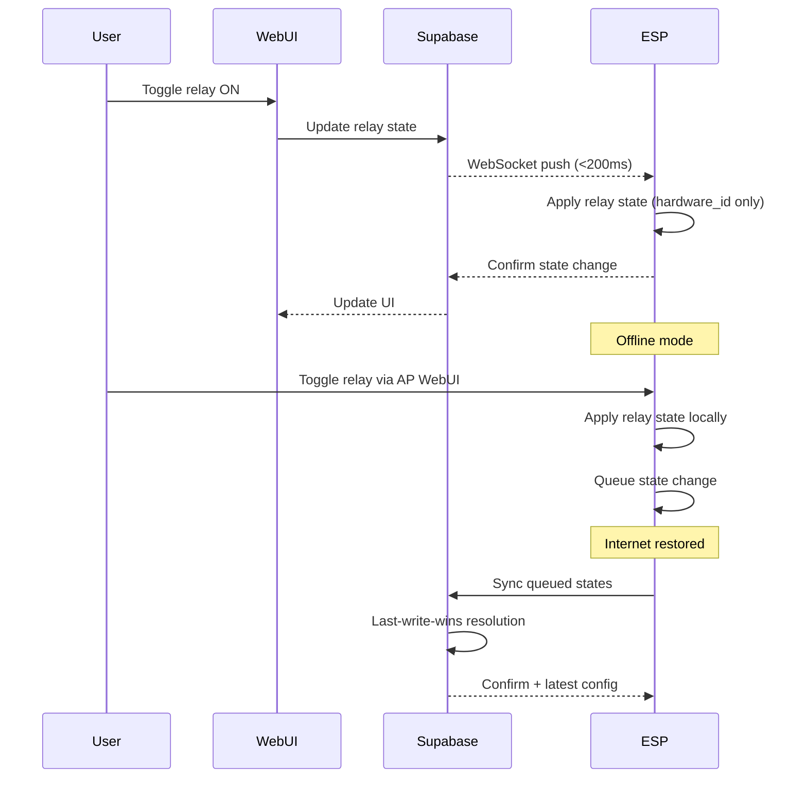

# Data Model: Smart Building System v2

## Entity Relationship Diagram (ERD)

```mermaid
erDiagram
    ESP_DEVICE ||--o{ RELAY : "contains"
    ESP_DEVICE ||--o{ STATE_SNAPSHOT : "has"
    ESP_DEVICE }o--|| CONFIG : "has"
    ESP_DEVICE }o--|| USER_DEVICE_ASSIGNMENT : "assigned_to"
    USER ||--o{ USER_DEVICE_ASSIGNMENT : "owns"
    RELAY ||--o{ STATE_SNAPSHOT : "records"

    ESP_DEVICE {
        uuid id PK
        string hardware_id "chip ID, unique"
        string name "friendly name, editable by admin"
        string device_type "always 'ESP32'"
        int relay_count
        bool is_online
        timestamp last_seen_at
        jsonb metadata "extensible metadata"
    }

    RELAY {
        uuid id PK
        uuid esp_device_id FK
        int hardware_channel "0-based index on ESP"
        string hardware_id "unique per device (e.g. 'relay_0')"
        string friendly_name "editable by admin, UI only"
        bool is_active
        int rated_power_watts
        timestamp created_at
        timestamp updated_at
    }

    USER_DEVICE_ASSIGNMENT {
        uuid id PK
        uuid user_id FK
        uuid esp_device_id FK
        string role "admin | user"
        timestamp assigned_at
    }

    STATE_SNAPSHOT {
        uuid id PK
        uuid relay_id FK
        uuid esp_device_id FK
        string state "ON | OFF"
        string source "local | cloud | timer | pir"
        timestamp recorded_at
    }

    CONFIG {
        uuid esp_device_id PK FK
        int sync_interval_seconds
        bool ap_mode_enabled
        jsonb rules "auto/PIR rules"
        timestamp updated_at
    }

    USER {
        uuid id PK "Supabase Auth"
        string email
        string role "admin | user"
        timestamp created_at
    }
```

## Entity Details

### ESP_DEVICE
Represents a physical ESP32 device in the system.

| Field | Type | Description |
|-------|------|-------------|
| id | uuid | Server-generated unique identifier |
| hardware_id | string | ESP32 chip ID (MAC-based), unique per device |
| name | string | Admin-editable friendly name for display |
| device_type | string | Always 'ESP32' (extensible for future devices) |
| relay_count | int | Number of relay channels on this device |
| is_online | boolean | Current connectivity status |
| last_seen_at | timestamp | Last communication with server |
| metadata | jsonb | Extensible metadata (firmware version, RSSI, etc.) |

**Constraints**:
- `hardware_id` must be unique
- `relay_count` must match the ESP firmware's RELAY_COUNT constant
- `name` max 64 characters, sanitized for XSS

### RELAY
Individual relay channel on an ESP device.

| Field | Type | Description |
|-------|------|-------------|
| id | uuid | Server-generated unique identifier |
| esp_device_id | uuid | FK to ESP_DEVICE |
| hardware_channel | int | 0-based relay index on the ESP |
| hardware_id | string | Immutable hardware identifier (e.g. 'relay_0') |
| friendly_name | string | Admin-editable label for UI display ONLY |
| is_active | boolean | Whether this relay is operational |
| rated_power_watts | int | Power rating for energy tracking |
| created_at | timestamp | Creation timestamp |
| updated_at | timestamp | Last update timestamp |

**Constraints**:
- `hardware_id` unique per esp_device_id
- `hardware_channel` 0 to RELAY_COUNT-1
- `friendly_name` max 128 characters
- ESP firmware NEVER reads `friendly_name` — it controls relays using `hardware_channel` only

### USER
System user (managed by Supabase Auth).

| Field | Type | Description |
|-------|------|-------------|
| id | uuid | Supabase Auth user ID |
| email | string | User email |
| role | string | 'admin' or 'user' |
| created_at | timestamp | Account creation time |

**Constraints**:
- `role` must be 'admin' or 'user'
- Admin users have full system access
- Regular users only see assigned devices

### USER_DEVICE_ASSIGNMENT
Links users to ESP devices they can access.

| Field | Type | Description |
|-------|------|-------------|
| id | uuid | Primary key |
| user_id | uuid | FK to USER |
| esp_device_id | uuid | FK to ESP_DEVICE |
| role | string | 'admin' or 'user' at device level |
| assigned_at | timestamp | Assignment timestamp |

**Constraints**:
- One user can be assigned to multiple devices
- One device can be assigned to multiple users
- Admin-level assignments bypass device-level role

### STATE_SNAPSHOT
Immutable log of relay state changes for audit and sync.

| Field | Type | Description |
|-------|------|-------------|
| id | uuid | Primary key |
| relay_id | uuid | FK to RELAY |
| esp_device_id | uuid | FK to ESP_DEVICE |
| state | string | 'ON' or 'OFF' |
| source | string | 'local', 'cloud', 'timer', 'pir' |
| recorded_at | timestamp | When the state change occurred |

**Constraints**:
- Append-only (no updates, no deletes)
- `state` must be 'ON' or 'OFF'
- `source` must be one of the defined sources

### CONFIG
Per-device configuration parameters.

| Field | Type | Description |
|-------|------|-------------|
| esp_device_id | uuid | PK, FK to ESP_DEVICE |
| sync_interval_seconds | int | How often to sync with server |
| ap_mode_enabled | boolean | Whether AP fallback is enabled |
| rules | jsonb | Auto/PIR rules configuration |
| updated_at | timestamp | Last update |

## State Diagram

```
[BOOT] --> LOAD_LOCAL_CACHE
LOAD_LOCAL_CACHE --> [ONLINE_MODE] (if internet available)
LOAD_LOCAL_CACHE --> [OFFLINE_AP_MODE] (if no internet)

[OFFLINE_AP_MODE] --> [SYNCING] (on internet restoration)
[SYNCING] --> [ONLINE_MODE] (sync complete)

[ONLINE_MODE] --> [OFFLINE_AP_MODE] (on internet loss)

[ANY_STATE] --> [POWER_LOSS]
[POWER_LOSS] --> [BOOT] (on power restoration)
```

## Event Flow


